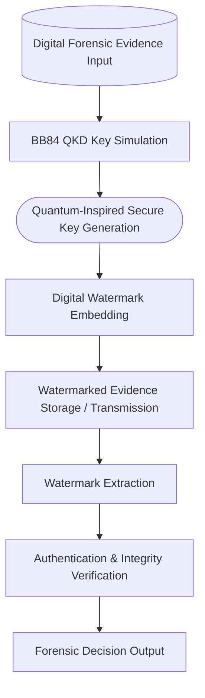

                                               V.S.Gopthreya_MinorProject
# Quantum-Inspired Digital Watermarking for Forensic Evidence Authentication Using BB84 QKD

### About the Project
This project proposes a quantum-inspired digital watermarking framework for forensic evidence authentication, leveraging principles from the BB84 Quantum Key Distribution (QKD) protocol. The primary objective is to ensure integrity, authenticity, and tamper detection of sensitive digital forensic evidence such as images, videos, or documents.
By integrating quantum cryptographic concepts with classical digital watermarking, the system introduces a novel, forward-looking approach to combating evidence manipulation, unauthorized access, and replay attacks in digital forensics.

### Why This Project?
Digital forensic evidence plays a critical role in legal investigations, cybercrime analysis, and judicial proceedings. However, existing systems face several limitations:
Vulnerability to tampering and forgery
Dependence on classical cryptographic keys, which are susceptible to future quantum attacks
Difficulty in detecting subtle modifications
Lack of strong key exchange guarantees
This project addresses these challenges by:
Introducing quantum-inspired security mechanisms
Applying BB84 QKD principles to watermark key generation
Enhancing trust, traceability, and legal admissibility of digital evidence

### About Digital Watermarking
Digital watermarking is a technique used to embed hidden information into digital media without significantly affecting perceptual quality.

#### Key Characteristics:
 1. **Imperceptibility:** The watermark does not degrade visual or audio quality
 2. **Robustness**: Resistant to compression, noise, cropping, and attacks
 3. **Security**: Difficult to detect, remove, or alter without authorization
 4. **Authentication**: Enables ownership verification and tamper detection
  
### Role in Digital Forensics:
 1. Ensures chain-of-custody
 2. Detects unauthorized modifications 
 3. Provides court-admissible integrity verification

#### In this project, watermarking is used as a forensic authentication layer, strengthened using quantum-inspired key management.

### About BB84 Quantum Key Distribution (QKD)
BB84 is the first and most widely known quantum key distribution protocol, proposed by Charles Bennett and Gilles Brassard (1984).

### Core Principles:
  Uses quantum states (polarization bases) to encode bits
  Any eavesdropping attempt introduces detectable disturbances
  Ensures unconditional security based on quantum mechanics
  
### Why BB84 in This Project?
Although real quantum hardware is not used, BB84 principles are simulated to:
  Generate high-entropy, unpredictable keys
  Prevent key interception and replay
  Introduce future-proof, quantum-resistant security
  
#### These keys are used for:
Watermark embedding
Watermark extraction and verification
Evidence authentication

## BB84 Quantum Key Distribution (Simulated)

## Digital Watermark Embedding Process

## Credits:
Developed by: VATNALA SHIVA GOPTHREYA KUMAR (AM.SC.P2CSN24012)

Program: M.Tech Cybersecurity Systems & Networks

Institution: Amrita School of Computing

Guide: Ms.SREELAKSHMI 
